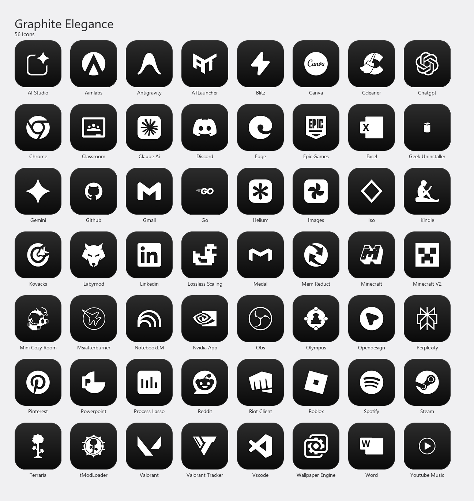

# Graphite Elegance

A premium, minimalist custom icon pack for Windows desktops. Designed to harmonize with dark modes and clean desktop aesthetics.

**56 icons** — apps, games, tools, and AI.



---

## Features

- **Multi-Resolution:** Each `.ico` includes 256, 128, 64, 48, 32, and 16 px renders — no Windows Explorer scaling artifacts.
- **Graphite Squircle:** Dark charcoal background with subtle gradient, drop shadow, and a 1 px inner border.
- **Pure White Silhouettes:** Every logo is thresholded to a clean white mask — no color noise, no gradients on the logo itself.

---

## How to Use — Auto (Python script)

> **Windows only.** Requires Python 3 installed on your system.

**Option A — one-click installer (recommended)**

Right-click `Tools\Install.ps1` → **Run with PowerShell**.  
It installs the required dependency and applies the icons automatically.

**Option B — manual pip**

```cmd
pip install pypiwin32
python Tools\apply_desktop_icons.py
```

The script scans your Desktop (user + public) and applies the matching icon to every `.lnk` and `.url` shortcut it finds. At the end it prints a list of any shortcuts that didn't have a matching icon in the pack. A single Explorer refresh is sent when done.

If icons don't update immediately after the script finishes, press **F5** on the desktop.

---

## How to Use — Manual

1. Right-click any shortcut → **Properties**.
2. Go to the **Shortcut** tab → **Change Icon...**.
3. Browse to `Icons\ICO\` and select the matching file.
4. Click **Apply** → **OK**.

---

*Created by Ayco.*
