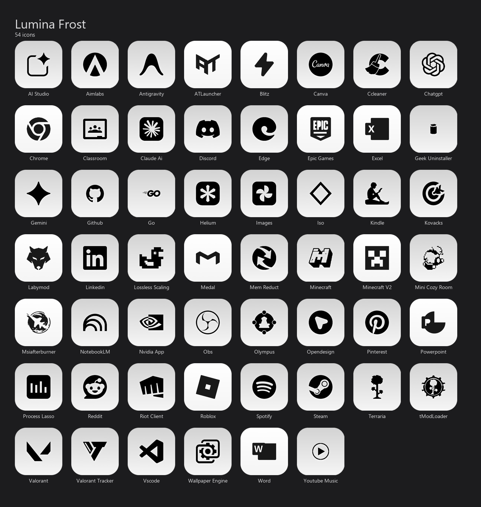

# Lumina Frost

A clean, minimalist custom icon pack for Windows desktops. Companion theme to Graphite Elegance — inverted color scheme designed for light-mode and minimal desktop setups.

**54 icons** — apps, games, tools, and AI.



---

## Features

- **Multi-Resolution:** Each `.ico` includes 256, 128, 64, 48, 32, and 16 px renders — no Windows Explorer scaling artifacts.
- **Frost Squircle:** Bright white background with a subtle gradient, dark charcoal logo silhouettes (#191919).
- **Pure Dark Silhouettes:** Every logo is thresholded to a clean dark mask — no color noise, maximum contrast.

---

## How to Use — Auto (Python script)

> **Windows only.** Requires Python 3 installed on your system.

**Option A — one-click installer (recommended)**

Right-click `Tools\Install.ps1` → **Run with PowerShell**.
It installs the required dependency and applies the icons automatically.

**Option B — manual pip**

```cmd
pip install pypiwin32
python Tools\apply_desktop_icons.py
```

The script scans your Desktop (user + public) and applies the matching icon to every `.lnk` and `.url` shortcut it finds. At the end it prints a list of any shortcuts that didn't have a matching icon in the pack.

If icons don't update immediately after the script finishes, press **F5** on the desktop.

---

## How to Use — Manual

1. Right-click any shortcut → **Properties**.
2. Go to the **Shortcut** tab → **Change Icon...**.
3. Browse to `Icons\ICO\` and select the matching file (inside the relevant category folder).
4. Click **Apply** → **OK**.

---

*Created by Ayco.*
