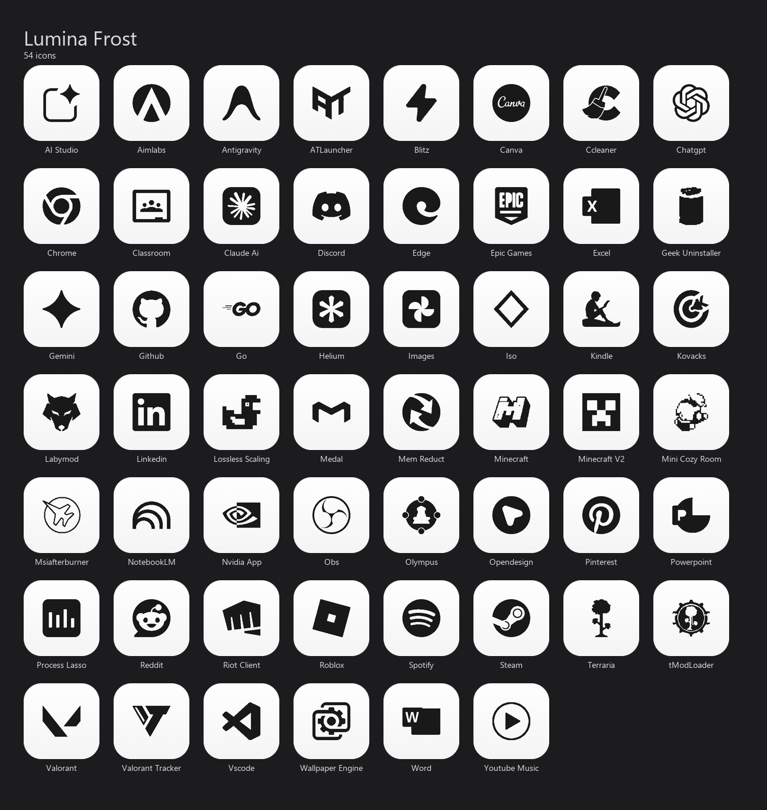

# Lumina Frost

A clean, minimalist custom icon pack for Windows desktops. Companion theme to
Graphite Elegance — inverted color scheme designed for light-mode and minimal
desktop setups.

**71 icons** — apps, games, tools, and AI. Organized by category
(`Games/`, `Productivity/`, `Social/`, `Utilities/`).



All icons ship the full 16/32/48/64/128/256 frame set and unique names
(`python ..\Tools\icon_validate.py --all`).

---

## Features

- **Multi-Resolution:** Each `.ico` includes 256, 128, 64, 48, 32, and 16 px renders — no Windows Explorer scaling artifacts.
- **Frost Squircle:** Bright white background with a subtle gradient, dark charcoal logo silhouettes (#191919).
- **Pure Dark Silhouettes:** Every logo is thresholded to a clean dark mask — no color noise, maximum contrast.

---

## How to Use — Auto (shared engine)

> **Windows only.** Requires Python 3. Install once: `pip install -r ..\requirements.txt`.

**Option A — one-click launcher**

Double-click `Tools\Install.bat`. This applies the icons only — it does **not**
rename shortcuts.

**Option B — manual (recommended flags)**

```cmd
:: apply icons only (safe default), from this theme folder
python ..\Tools\icon_engine.py --config theme.json

:: hide shortcut names (opt-in) and clean launcher duplicates
python ..\Tools\icon_engine.py --config theme.json --rename --cleanup

:: preview without changing anything
python ..\Tools\icon_engine.py --config theme.json --dry-run
```

If icons don't update immediately, press **F5** on the Desktop.
See `../Tools/README.md` for all flags, backups and `--restore`.

---

## How to Use — Manual

1. Right-click any shortcut → **Properties**.
2. Go to the **Shortcut** tab → **Change Icon...**.
3. Browse to `Icons\ICO\` and select the matching file (inside the relevant category folder).
4. Click **Apply** → **OK**.

---
*Created by Ayco.*
