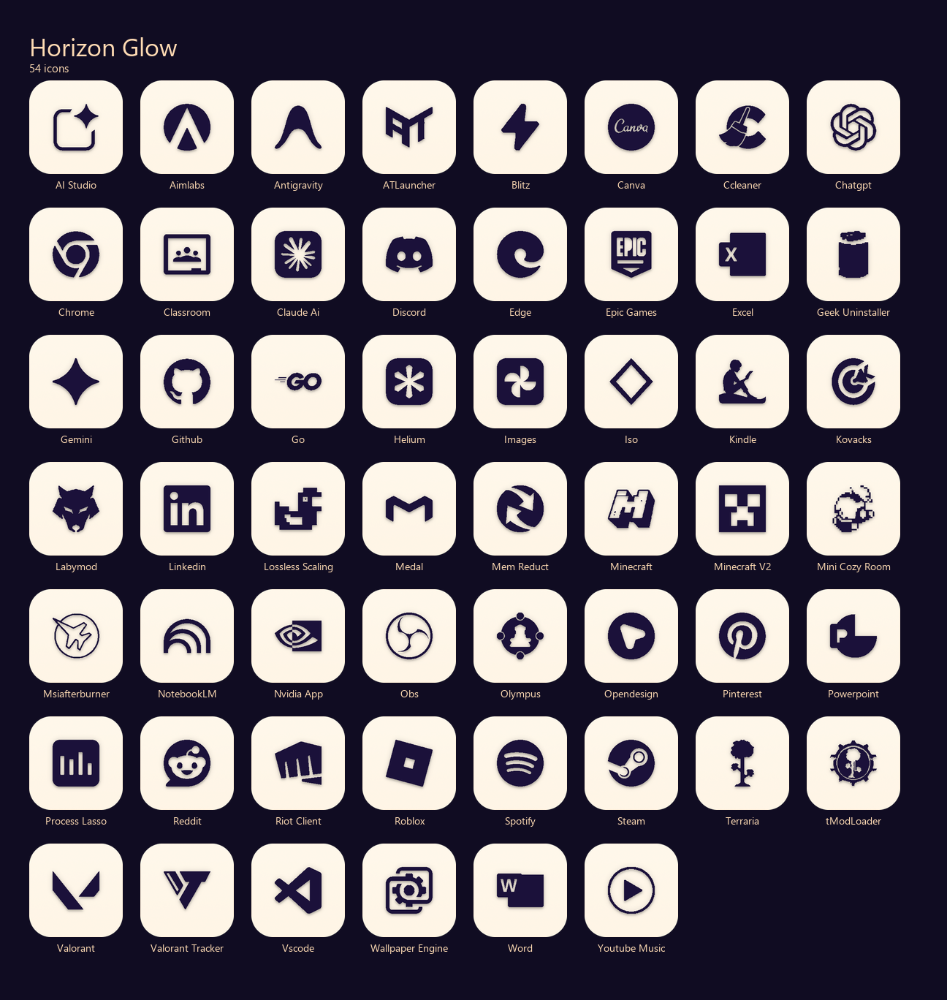
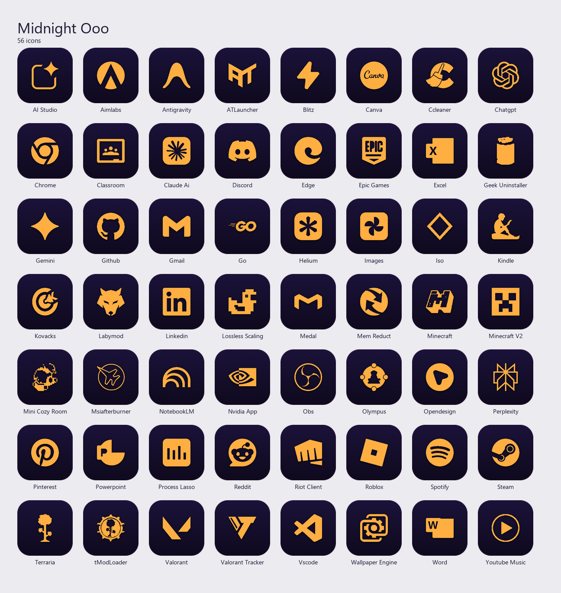

# Ooo — Horizon Glow & Midnight Ooo

Two premium, minimalist icon variants for Windows desktops, sharing the same
geometry with different palettes: **Horizon Glow** (warm gradient) and
**Midnight Ooo** (deep night tones).

Two sets — apps, games, tools, and AI.





---

## Features

- **Multi-Resolution:** Each `.ico` includes 256, 128, 64, 48, 32, and 16 px renders — no Windows Explorer scaling artifacts.
- **Squircle geometry:** Rounded-square base with flat, minimal silhouettes.
- **Two palettes:** `Icons/Horizon_Glow/` and `Icons/Midnight_Ooo/`.

---

## How to Use — Auto (shared engine)

> **Windows only.** Requires Python 3 installed on your system.

**Option A — one-click launcher**

Double-click the launcher of the variant you want:

- `Tools\apply_horizon_glow.bat`
- `Tools\apply_midnight_ooo.bat`

**Option B — manual**

```cmd
pip install -r ..\requirements.txt

:: Horizon Glow
python ..\Tools\icon_engine.py --config theme_horizon_glow.json

:: Midnight Ooo
python ..\Tools\icon_engine.py --config theme_midnight_ooo.json
```

The engine scans your Desktop (user + public) and applies the matching icon to
every `.lnk` and `.url` shortcut it finds. At the end it prints any shortcuts
that had no matching icon, and sends one Explorer refresh.

If icons don't update immediately after it finishes, press **F5** on the Desktop.

The shared engine lives at `../Tools/icon_engine.py`; see `../Tools/README.md`.

---

## How to Use — Manual

1. Right-click any shortcut → **Properties**.
2. Go to the **Shortcut** tab → **Change Icon...**.
3. Browse to `Icons\Horizon_Glow\` or `Icons\Midnight_Ooo\` and pick the file.
4. Click **Apply** → **OK**.

---
*Created by Ayco.*
