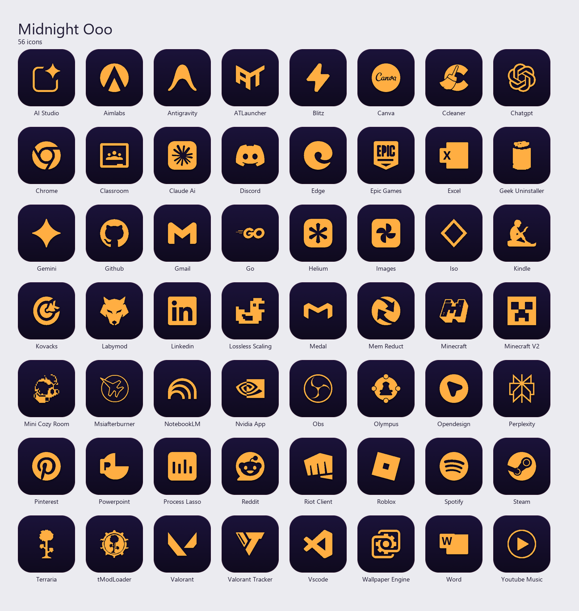
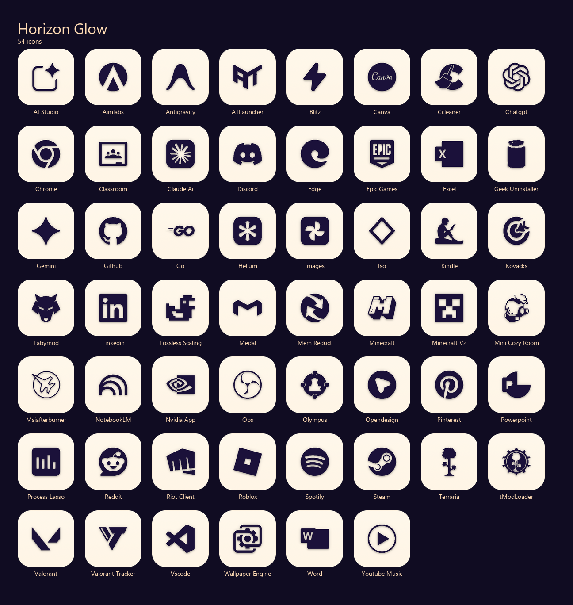

# Isoform — Aesthetic Windows Icon Suites 🌑✨
*Created by [Acourd](https://github.com/Acourd)*

A collection of premium, minimalist, and geometric icon suites for Windows desktops.

---

## 🎨 Theme Previews

<details>
<summary>Graphite Elegance</summary>
<br>


</details>

<details>
<summary>Lumina Frost</summary>
<br>


</details>

<details>
<summary>Midnight Ooo</summary>
<br>


</details>

<details>
<summary>Horizon Glow</summary>
<br>


</details>

---

## 📂 Repository Structure

Each theme folder is self-contained:
```text
[Theme_Name]_Release/
│
├── Icons/
│   ├── ICO/          ← Multi-resolution Windows .ico (256, 128, 64, 48, 32, 16 px)
│   └── PNG/          ← High-definition transparent assets for docks or Linux
│
├── Tools/
│   └── apply_desktop_icons.py    ← Automator script with duplicate cleanup
│
└── Apply_Theme.ps1   ← PowerShell launcher (Right-click ➔ Run with PowerShell)
```

---

## 🚀 Quick Start

1. Open the folder of the theme you want to apply (e.g., `Graphite_Elegance_Release`).
2. Right-click **`Apply_Theme.ps1`** and select **"Run with PowerShell"**.
3. The script applies the custom icons, renames shortcuts to **invisible names**, and refreshes Windows Explorer automatically.

### Anti-Duplication Safeguard
If a game launcher (like Steam, Riot, Epic, or Rockstar) recreates a visible shortcut on startup, the applicator script will automatically detect and delete the visible duplicate if an invisible themed counterpart already exists.

---

## 🔍 Troubleshooting & UAC Limitations

*   **Public Shortcuts (Epic Games, Valorant, Riot, etc.):** If you run the script without administrator privileges, it might not be able to delete or rename shortcuts located in the Public Desktop (`C:\Users\Public\Desktop`) due to Windows UAC permissions. If this happens, move those public shortcuts to your personal Desktop folder (`%userprofile%\Desktop`) and run the script again.
*   **Icons don't refresh immediately:** Click on an empty space on your Desktop and press `F5` (or right-click ➔ Refresh). In extreme cases, sign out and sign back in to Windows.
*   **Offline usage:** The script automatically attempts to install `pypiwin32` via `pip` on first run. If you are offline, you can manually install the dependency beforehand with: `pip install pypiwin32 --user`.

---
*Developed with mathematical rigor and aesthetic passion. © 2026 Acourd.*
