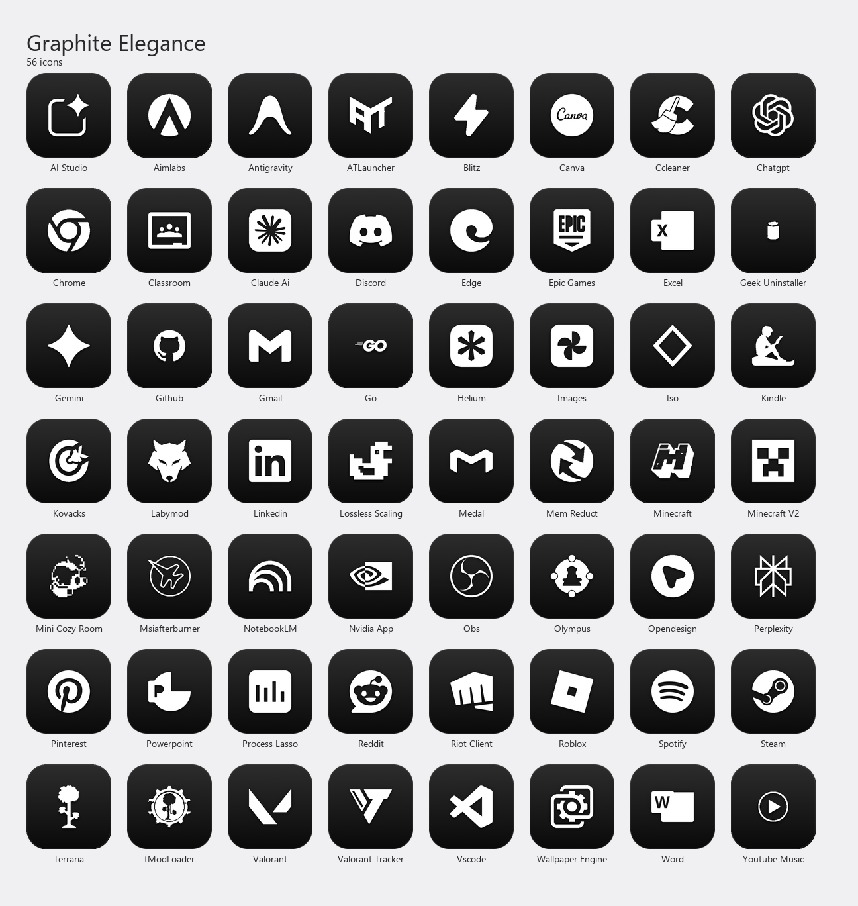

# Isoform — Aesthetic Windows Icon Suites 🌑✨
*Created by [Acourd](https://github.com/Acourd)*

A collection of premium, minimalist, and geometric icon suites for Windows desktops.

| Theme | Icons | Notes |
|---|---:|---|
| Graphite Elegance | 73 | dark squircle, white silhouettes |
| Lumina Frost | 71 | light squircle, dark silhouettes |
| Midnight Ooo | — | deep night palette |
| Horizon Glow | — | warm gradient palette |
| White Space Pixel | 69 | pixel-art variant |
| KiraLight (Dark / Light) | 138 | 2 × 69 |

---

## 🎨 Theme Previews

<details><summary>Graphite Elegance</summary><br>


</details>

<details><summary>Lumina Frost</summary><br>


</details>

<details><summary>Midnight Ooo</summary><br>


</details>

<details><summary>Horizon Glow</summary><br>


</details>

---

## 📂 Repository Structure

```text
.
├── Generator/                    ← icon factory (scripts + raw assets)
│   ├── scripts/                  ← silhouette → compose → PNG → .ico
│   └── assets/Raw_Silhouettes/   ← source logos
│
├── Tools/                        ← shared engine
│   ├── icon_engine.py            ← one applicator + organizer for every theme
│   └── icon_validate.py          ← icon resolution/name gate (used by CI)
│
└── [Theme]_Release/
    ├── Icons/ICO/                ← multi-resolution .ico (256, 128, 64, 48, 32, 16 px)
    ├── theme.json                ← theme config for the shared engine
    ├── Tools/apply_desktop_icons.py  ← thin shim → Tools/icon_engine.py
    └── Apply_Theme.ps1           ← launcher (Right-click ➔ Run with PowerShell)
```

The engine lives once at `Tools/icon_engine.py`; each theme only carries a
`theme.json`. The former per-theme applicators were removed.

---

## 🚀 Quick Start

1. `pip install -r requirements.txt` (the engine never auto-installs anything).
2. Open the theme folder (e.g. `Graphite_Elegance_Release`).
3. Right-click **`Apply_Theme.ps1`** ➔ **"Run with PowerShell"**, or run
   `Tools\Install.bat`.

By default this only **applies icons**. Destructive / cosmetic steps are
**opt-in**:

```bat
:: apply icons only (safe default)
python Tools\icon_engine.py --config Graphite_Elegance_Release\theme.json

:: preview without writing anything
python Tools\icon_engine.py --config Graphite_Elegance_Release\theme.json --dry-run

:: hide shortcut names (accessibility: opt-in) and clean launcher duplicates
python Tools\icon_engine.py --config Graphite_Elegance_Release\theme.json --rename --cleanup

:: reorder already-applied shortcuts
python Tools\icon_engine.py --config Graphite_Elegance_Release\theme.json --organize

:: undo a previous run
python Tools\icon_engine.py --restore "%LOCALAPPDATA%\Icons_Engine\backups\<key>\<timestamp>"
```

Every change is backed up under `%LOCALAPPDATA%\Icons_Engine\backups\`.

### Note on invisible names
`--rename` uses non-breaking spaces, which makes shortcut names invisible to
screen readers, search and keyboard navigation. It is therefore **opt-in**, not
a default.

---

## 🏭 Regenerating & validating icons

```bat
:: factory setup
pip install -r Generator\requirements.txt

:: silhouette → composed PNG (see Generator/README.md)
python Generator\scripts\generate_premium_icons.py

:: PNG/ICO master → multi-resolution .ico (16/32/48/64/128/256)
python Generator\scripts\images_to_ico.py --input <theme>\Icons\ICO --overwrite --recursive

:: gate: fails on incomplete resolutions or duplicate names
python Tools\icon_validate.py --all
```

> **Validation gate:** every released `.ico` carries the full
> 16/32/48/64/128/256 frame set and unique names per variant.
> `python Tools\icon_validate.py --all` → **0 errors, 0 warnings**. The contract
> is documented in [docs/ICON_FORMAT.md](docs/ICON_FORMAT.md).

---

## 🤝 Contributing, License, Security

- [CONTRIBUTING.md](CONTRIBUTING.md) — dev setup, checks, contracts.
- [LICENSE](LICENSE) — MIT (third-party logos excluded).
- [SECURITY.md](SECURITY.md) — safety model and vulnerability reporting.

---
*Developed with mathematical rigor and aesthetic passion. © 2026 Acourd.*
